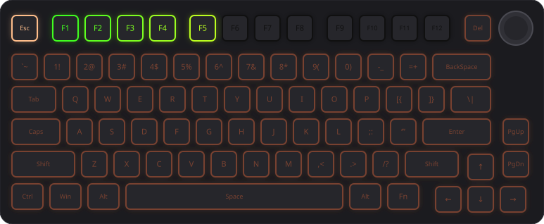
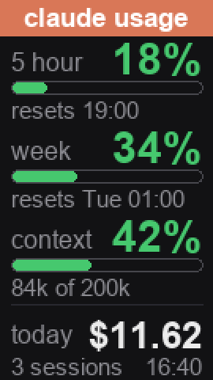
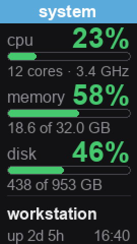
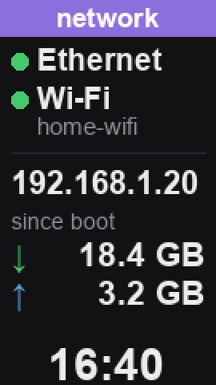

# mokuru

**[goriparthi.github.io/mokuru](https://goriparthi.github.io/mokuru/)**: see it in action

An open-source companion app for the **MOKURU AK8753** keyboard: live screens
on its LCD, lighting you can script, a dial that switches apps, and keys that
show what **Claude Code** is doing. Runs on Windows, macOS and Linux.

[](https://goriparthi.github.io/mokuru/)

- **Live LCD screens:** Claude usage, system (CPU, memory, disk) and network,
  on the keyboard's 135×240 screen. Press Fn + dial to flip through them.
- **Lighting:** every effect the keyboard has, in any colour and speed, from
  the command line or the tray. Your lighting is what the board returns to.
- **Ctrl + dial = app switcher** (Windows): hold Ctrl and turn to walk through
  windows like Alt+Tab, release Ctrl to pick one; Ctrl + press opens Task View.
  The dial alone is still volume.
- **Claude Code on your keys** (optional): Claude-orange while it works, with
  the context window filling up across F1–F12, red when it needs your
  permission, and a green flash when it's done.
- **Cable or 2.4 GHz:** lighting works through the wireless dongle too, with
  a battery readout.
- **Tray icon and autostart**, your own pictures on the LCD, and a clock that
  stays synced.

## LCD screens

<table>
<tr>
<td align="center" width="33%"><br><b>Claude usage</b></td>
<td align="center" width="33%"><br><b>System</b></td>
<td align="center" width="33%"><br><b>Network</b></td>
</tr>
<tr>
<td valign="top">5-hour and weekly plan limits with reset times, context used (percent and tokens), and dollars spent today across all sessions. Drawn from Claude Code's own status line.</td>
<td valign="top">CPU load, core count and clock; memory and disk in use; machine name and uptime.</td>
<td valign="top">Which connections are up (Ethernet, Wi-Fi with its network name, VPN), your IP, data used since boot, and the time.</td>
</tr>
</table>

Bars turn yellow at 70% and red at 90%. The keyboard keeps its own clock
page too. Each screen redraws only when its numbers move, at most every 5
minutes; the network screen also redraws every 10 minutes to keep its time
current. An upload takes
about 20 s and is spaced to spare the keyboard's flash. Slots 3 and 4 are
free for your own pictures (`mokuru image`).

## Install

```sh
pipx install "git+https://github.com/goriparthi/mokuru.git#egg=mokuru[tray]"
# or, from a clone:  pip install -e ".[tray]"

mokuru info                 # finds the keyboard (plug it in by USB cable)
mokuru install autostart    # start the tray/daemon at login
mokuru install hooks        # optional: Claude Code hooks in ~/.claude/settings.json
mokuru install statusline   # optional: feeds the Claude usage screen
```

Linux also needs a udev rule so you can open the keyboard without root:
`mokuru install udev` prints the two commands (a copy is in `contrib/`).

## Everyday use

```sh
mokuru light wave                         # rainbow wave (no --color = rainbow)
mokuru light static --color 00ffcc        # any colour
mokuru light breathing --color d97757 --speed 1
mokuru light off
mokuru image photo.jpg                    # your picture in a free slot (~20 s)
mokuru lcd usage | off                    # the live screens on the LCD
mokuru lcd blank 2 3 4                    # clear leftover pictures from slots
mokuru clock                              # set the LCD clock (the daemon also does this daily)
mokuru pause | resume                     # stop/start reacting to Claude Code
mokuru status                             # daemon state as JSON
mokuru start | stop | tray | daemon
```

`mokuru light …` sets *your* lighting: it's what the keyboard returns to when
Claude is idle.

## How it works

A small daemon owns the keyboard. It listens on `127.0.0.1` only (port 38917,
or the next free one; the port is written to `~/.mokuru/daemon.port`) and
accepts JSON only, so web pages can't drive it. The CLI and the Claude Code
hooks talk to it, and start it if it isn't running.

| Claude Code | Keys |
|---|---|
| prompt submitted | working: per-key Claude-orange, Esc bright, F1–F12 = context used |
| permission prompt | fast red breathing |
| tool finished after a permission | back to working |
| stopped | green for 4 s, then your lighting |

With several Claude sessions open, the most urgent one wins
(needs-you > working > done).

### Ctrl + dial

The dial sends ordinary Volume Up/Down/Mute keys, and the keyboard's firmware
ignores its Fn layer for the dial, so this can't be done on the keyboard itself.
Instead the daemon installs a Windows low-level keyboard hook: with Ctrl held,
dial clicks are swallowed and turned into a held-Alt Tab / Shift+Tab sequence.
It only works while the daemon runs (`mokuru install autostart`). Turn it off
with `"dial_switcher": false`. macOS and Linux aren't supported yet.

### Status line

Claude Code gives its status-line command a JSON payload with the model,
context window and cost. mokuru reads it from `~/.mokuru/status.json`.
`mokuru install statusline` wraps your existing status line with
`mokuru tap -- <your command>`. If your status line is a bash script, it's
cheaper to add one line after it reads stdin into `$payload`:

```sh
mkdir -p "$HOME/.mokuru" && printf '%s' "$payload" > "$HOME/.mokuru/status.json"
```

## Settings

`~/.mokuru/config.json` (created on first save; defaults shown):

```json
{
  "port": 38917,
  "claude_lighting": true,
  "per_key": true,
  "done_hold": 4.0,
  "dial_switcher": true,
  "colors": {"working": [217, 119, 87], "attention": [255, 0, 0], "done": [0, 220, 60]},
  "lcd": {"enabled": true, "screens": {"0": "usage", "1": "system", "2": "network"}, "min_interval": 300}
}
```

## Hardware notes and limits

- **Keyboard:** MOKURU AK8753, USB `3151:5002`, vendor device 3177 (ROYUAN gen2
  command set, yc3123 chip). Other ROYUAN boards speak similar dialects but
  differ in the details; this package checks the device ID before writing.
- **2.4 GHz works for lighting.** Over the dongle (`3151:5006`) every command
  is relayed through the receiver, so colours, Claude states and the per-key
  bar all work, and `mokuru status` shows the keyboard's battery. LCD frames
  need the USB cable. When both are connected the cable wins, and the daemon
  switches between them as you plug and unplug. Bluetooth can't carry these
  commands.
- **Flash wear.** Per-key patterns and LCD frames are written to the keyboard's
  flash. mokuru spaces flash writes at least 10 s apart, re-uploads the per-key
  pattern only when the context bar gains or loses a key, and refreshes the usage
  card at most every 5 minutes and only when something visible changed.
  Whole-board lighting changes are cheap and instant.
- **LCD updates are slow**, about 20 s for a full frame. A smaller box doesn't
  help: it replaces the picture rather than patching it.
- **LCD pages.** Fn + pressing the dial cycles the screen's pages (clock,
  pictures). Animations aren't supported: this keyboard plays multi-frame
  uploads back shifted, so mokuru only writes still pictures.
- **Never sent:** `0xAC` (erases every stored picture), `0x7F`/`0x30` (firmware
  boot entry). `mokuru.device.packet()` refuses them.

## Credits

The protocol comes from the reverse-engineering notes in
[sharkfin](https://github.com/dniminenn/sharkfin) (`docs/PROTOCOL.md`), plus
the keyboard's own responses. This is an independent implementation.

## Development

```sh
pip install -e ".[tray,dev]"
pytest                      # no keyboard needed
python tools/build_site.py  # re-render the website images in docs/assets
```

The website lives in `docs/` and is published by `.github/workflows/pages.yml`.
